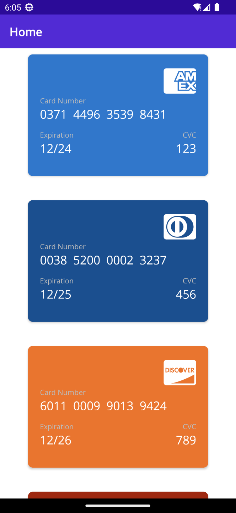
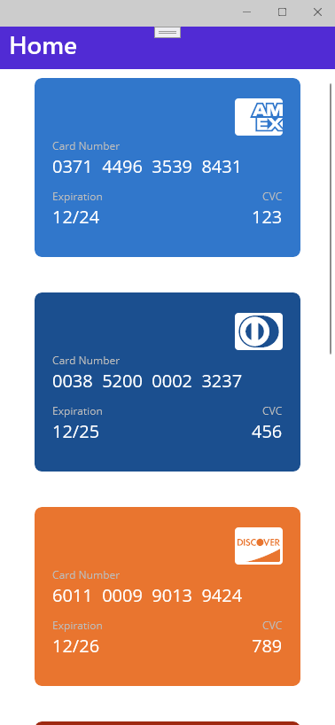

# Simple Credit Card view for .NET MAUI

I prepared a short article on [medium.com](https://medium.com/@tsjdevapps/create-a-credit-card-view-in-net-maui-df74c20f11e0) as contribution to [#MAUIUIJULY](https://twitter.com/hashtag/MAUIUIJULY), which is basically a series of blog posts where every day of July 2023 a .NET MAUI community member posts something about .NET MAUI and UI. You can find the list with all available blog posts on [this website](https://goforgoldman.com/posts/maui-ui-july-23/).

## Usage

The repository contains a sample project, which shows how to use the `CreditCardView` control. The control is available for Android, iOS, macOS, and Windows. The control is available in the `CreditCardApp.Views` namespace.

```xml
xmlns:views="clr-namespace:CreditCardApp.Views"
```

You can use the control like this:

```xml
<views:CreditCardView CardNumber="371449635398431"                                  
                      ExpirationDate="2024-12-01"
                      CardValidationCode="123"/>
```

The control has the following properties:

| Property | Description | Default |
| --- | --- | --- |
| `CardNumber` | The credit card number. | `null` |
| `ExpirationDate` | The expiration date of the credit card. | `DateTime.Now` |
| `CardValidationCode` | The card validation code. | `-` |

## Screenshots

### Android


### Windows



## Buy me a coffee ☕
I appreciate any form of support to keep my *Open Source* activities going.

Whatever you decide, be it sharing my blog posts, using my packages or buying me a coffee/book, thank you ❤️.

<a href="https://www.buymeacoffee.com/tsjdevapps" target="_blank"></a>